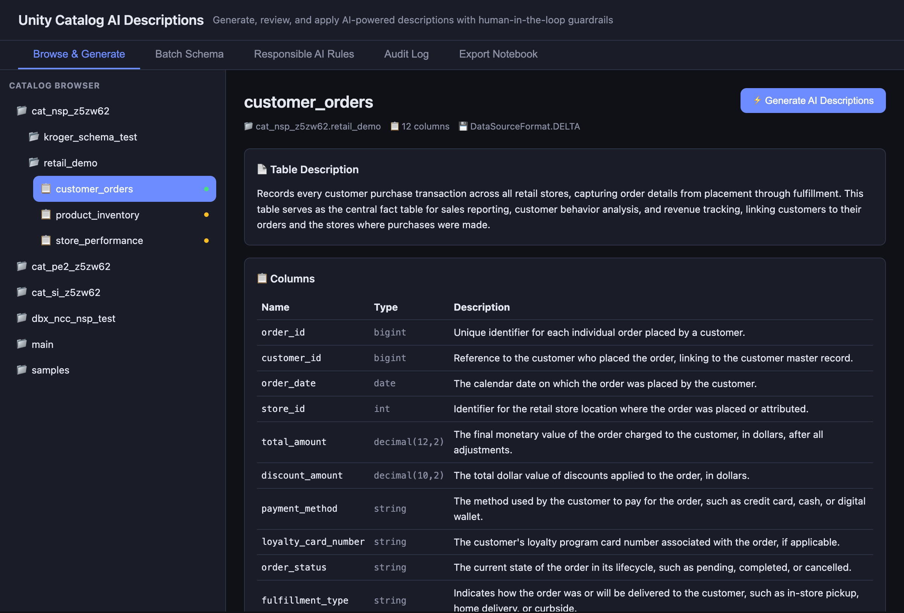
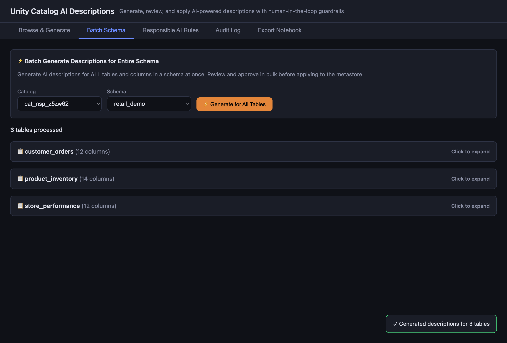
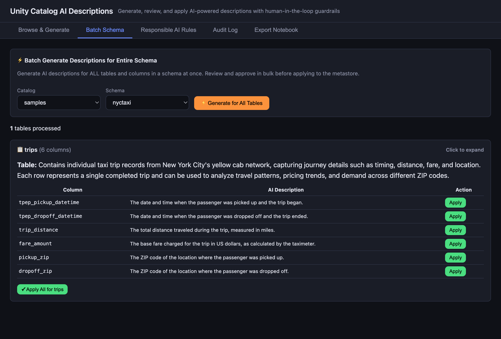
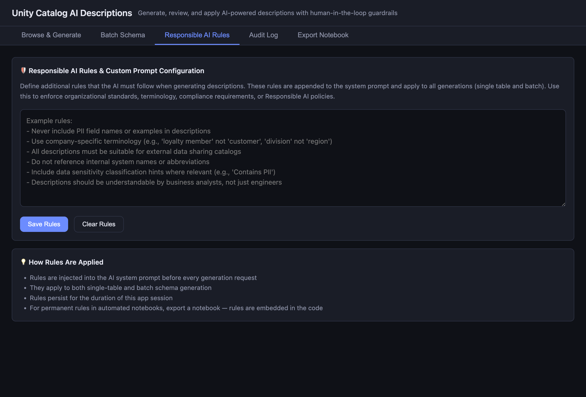
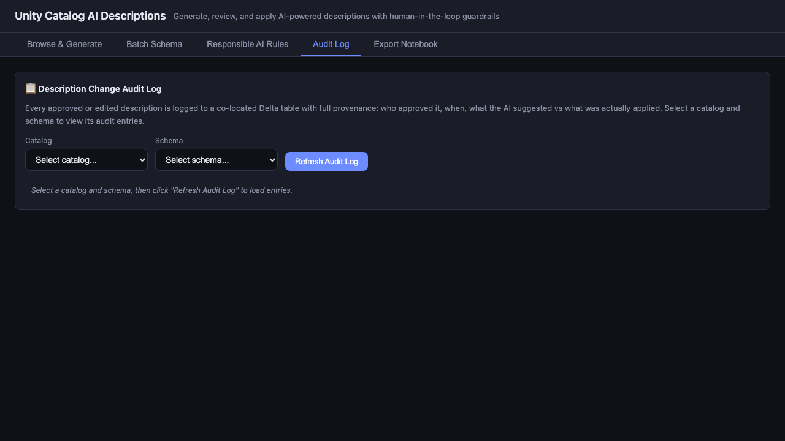
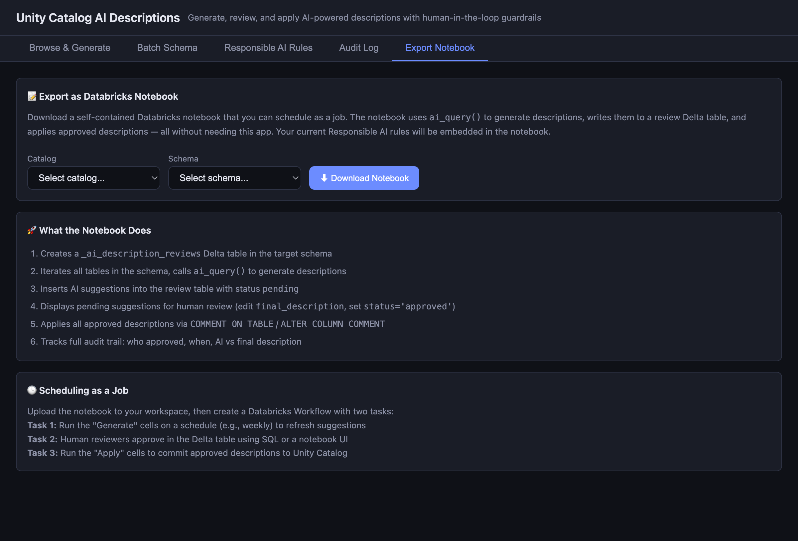

# Unity Catalog AI Descriptions - Databricks App

A Databricks App that generates AI-powered descriptions for Unity Catalog tables and columns using Claude on Foundation Model API (FMAPI), with human-in-the-loop review and Responsible AI guardrails.

Deployable as a **Databricks Asset Bundle** with git-controlled configuration.

## Problem Statement

Databricks Unity Catalog supports AI-generated descriptions for tables and columns via the UI, but customers need:
1. **Programmatic/automated access** - Apply AI descriptions at scale via API, not one table at a time in the UI
2. **Human-in-the-loop review** - Review AI suggestions before applying, with ability to edit
3. **Responsible AI guardrails** - Enforce organizational rules (PII handling, terminology, compliance)
4. **Audit trail** - Track who approved what, when, and what the AI originally suggested vs what was applied

## Architecture

```
Browser  -->  Databricks App (FastAPI)  -->  Foundation Model API (Claude Sonnet)
                    |                              |
                    v                              v
             Unity Catalog API            AI Description Generation
             (browse / apply)             (single + batch)
                    |
                    v
             Delta Table (Co-located Audit Log)
```

### Configuration Architecture

Two-layer git-controlled configuration:

| Layer | File | Controls |
|-------|------|----------|
| Infrastructure | `databricks.yml` | Warehouse ID, serving endpoint, app title (env vars per target) |
| App Behavior | `config.yaml` | Responsible AI rules, audit table name, catalog/schema exclusions |

## Features

### 1. Browse & Generate (Single Table)
Browse the Unity Catalog tree (catalogs > schemas > tables), view table metadata and columns, then generate AI descriptions with one click. Review each suggestion and approve, edit, or reject before applying to the metastore.



### 2. Batch Schema Processing
Generate AI descriptions for ALL tables in a schema at once. Results are expandable per-table with individual approve/apply controls for both table-level and column-level descriptions.





### 3. Responsible AI Rules (Read-Only, Git-Controlled)
Responsible AI rules are defined in `config.yaml` and injected into the AI system prompt for every generation request. Rules are version-controlled and read-only in the UI — changes require editing `config.yaml` and redeploying.

Example rules:
- Never include PII field names or example values in descriptions
- Use business-friendly language suitable for a data catalog audience
- Do not reference internal system names or implementation details



### 4. Audit Log (Co-located)
Every approved or edited description is logged to a co-located Delta table (`_ai_description_audit`) in the **same catalog/schema** as the described tables, with full provenance:
- Who approved it
- When it was applied
- What the AI originally suggested
- What was actually applied (may differ if edited)
- Whether it was approved as-is or edited



### 5. Export as Databricks Notebook
Download a self-contained Python notebook that can be scheduled as a Databricks Workflow job. The notebook:
1. Creates a `_ai_description_reviews` Delta table
2. Uses `ai_query()` to generate descriptions for all tables in a schema
3. Inserts suggestions as "pending" for human review
4. Applies approved descriptions via `COMMENT ON TABLE` / `ALTER COLUMN COMMENT`
5. Tracks full audit trail



## Deployment (DAB)

### Prerequisites
- Databricks workspace with Unity Catalog enabled
- Databricks CLI v0.229.0+ authenticated
- A SQL warehouse (serverless recommended)
- Access to a Foundation Model serving endpoint (e.g., `databricks-claude-sonnet-4-6`)

### Step 1: Clone and Configure

```bash
git clone https://github.com/sprakash277/uc-ai-descriptions.git
cd uc-ai-descriptions
```

**Edit `config.yaml`** to customize Responsible AI rules and exclusions:
```yaml
responsible_ai_rules: |
  - Never include PII field names or example values in descriptions.
  - Use business-friendly language suitable for a data catalog audience.

audit:
  table_name: "_ai_description_audit"

exclusions:
  catalogs:
    - "__databricks_internal"
    - "system"
  schemas:
    - "information_schema"
```

### Step 2: Authenticate

```bash
databricks auth login --host https://<your-workspace>.azuredatabricks.net --profile <your-profile>
databricks auth profiles | grep <your-profile>
```

### Step 3: Validate and Deploy the Bundle

```bash
# Validate
databricks bundle validate --profile <your-profile>

# Deploy (uploads files + creates/updates app resource)
databricks bundle deploy --profile <your-profile>

# Deploy the app runtime
databricks apps deploy uc-ai-descriptions \
  --source-code-path /Workspace/Users/<your-email>/.bundle/uc-ai-descriptions/dev/files \
  -p <your-profile>
```

### Step 4: Attach Resources

Add the SQL warehouse and serving endpoint as app resources:
```bash
databricks api patch /api/2.0/apps/uc-ai-descriptions --profile <your-profile> --json '{
  "resources": [
    {"name": "sql-warehouse", "sql_warehouse": {"id": "<warehouse-id>", "permission": "CAN_USE"}},
    {"name": "serving-endpoint", "serving_endpoint": {"name": "databricks-claude-sonnet-4-6", "permission": "CAN_QUERY"}}
  ]
}'
```

### Step 5: Grant Service Principal Permissions

Find the SP application ID:
```bash
databricks apps get uc-ai-descriptions -p <your-profile> | grep service_principal_client_id
```

Grant Unity Catalog permissions (run in SQL or notebook):
```sql
-- Replace <sp-id> with the SP's UUID
GRANT USE CATALOG ON CATALOG <catalog> TO `<sp-id>`;
GRANT USE SCHEMA ON SCHEMA <catalog>.<schema> TO `<sp-id>`;
GRANT SELECT, MODIFY ON SCHEMA <catalog>.<schema> TO `<sp-id>`;
GRANT CREATE TABLE ON SCHEMA <catalog>.<schema> TO `<sp-id>`;
```

### Step 6: Redeploy and Verify

```bash
# Redeploy to pick up resource permissions
databricks apps deploy uc-ai-descriptions \
  --source-code-path /Workspace/Users/<your-email>/.bundle/uc-ai-descriptions/dev/files \
  -p <your-profile>

# Check status
databricks apps get uc-ai-descriptions -p <your-profile>
```

Navigate to the app URL and test the workflow:
1. **Browse & Generate** — Select a catalog > schema > table, click "Generate AI Descriptions"
2. **Approve/Edit** — Review suggestions, approve or edit, click "Apply to Metastore"
3. **Batch Schema** — Select a catalog and schema, click "Generate for All Tables"
4. **Responsible AI Rules** — Verify rules from `config.yaml` are displayed (read-only)
5. **Audit Log** — Click "Refresh Audit Log" to see entries
6. **Export Notebook** — Download a notebook for scheduled automation

### Updating the App

After code changes:
```bash
databricks bundle deploy --profile <your-profile>
databricks apps deploy uc-ai-descriptions \
  --source-code-path /Workspace/Users/<your-email>/.bundle/uc-ai-descriptions/dev/files \
  -p <your-profile>
```

### Viewing App Logs

```
https://uc-ai-descriptions-<workspace-id>.azure.databricksapps.com/logz
```

Or via CLI:
```bash
databricks apps logs uc-ai-descriptions --tail-lines 50 -p <your-profile>
```

## Configuration

### `databricks.yml` — Infrastructure (per-environment)

| Variable | Default | Description |
|----------|---------|-------------|
| `warehouse_id` | `""` (auto-detect) | SQL warehouse ID; empty = auto-select running serverless warehouse |
| `serving_endpoint` | `databricks-claude-sonnet-4-6` | Foundation Model API endpoint name |
| `app_title` | `Unity Catalog AI Descriptions` | Display title in the app header |

Override per target:
```yaml
targets:
  prod:
    variables:
      serving_endpoint: "databricks-claude-sonnet-4-6"
      warehouse_id: "abc123def456"
```

### `config.yaml` — App Behavior (git-controlled)

| Setting | Default | Description |
|---------|---------|-------------|
| `responsible_ai_rules` | (see file) | Rules injected into every AI generation prompt |
| `audit.table_name` | `_ai_description_audit` | Name of the co-located audit table |
| `exclusions.catalogs` | `["__databricks_internal", "system"]` | Catalogs hidden from the browse tree |
| `exclusions.schemas` | `["information_schema"]` | Schemas hidden from the browse tree |

## Project Structure

```
uc-ai-descriptions/
  databricks.yml        # DAB bundle definition (infrastructure config)
  config.yaml           # App behavior config (rules, exclusions, audit)
  app.py                # FastAPI entry point, serves static frontend + API
  app.yaml              # Databricks App runtime command config
  requirements.txt      # Python dependencies
  server/
    __init__.py
    config.py           # Central config loader (config.yaml + env vars) + auth
    warehouse.py        # Centralized warehouse resolution with caching
    sql_utils.py        # SQL safety (identifier validation, comment escaping)
    catalog.py          # Unity Catalog operations (browse, apply comments)
    ai_gen.py           # AI description generation via FMAPI + notebook export
    audit.py            # Co-located Delta table audit logging
    routes.py           # All API endpoints
  static/
    index.html          # Single-page frontend (HTML/CSS/JS)
  screenshots/          # App screenshots for documentation
```

## API Endpoints

| Method | Path | Description |
|--------|------|-------------|
| GET | `/api/health` | Health check |
| GET | `/api/settings` | Current effective configuration |
| GET | `/api/warehouses` | List available SQL warehouses with state |
| GET | `/api/catalogs` | List all catalogs (respects exclusions) |
| GET | `/api/schemas/{catalog}` | List schemas in a catalog |
| GET | `/api/tables/{catalog}/{schema}` | List tables in a schema |
| GET | `/api/table/{full_name}` | Get table details + columns |
| POST | `/api/generate` | Generate AI descriptions for a single table |
| POST | `/api/generate/batch` | Generate AI descriptions for all tables in a schema |
| POST | `/api/apply/table` | Apply a table comment |
| POST | `/api/apply/column` | Apply a column comment |
| POST | `/api/apply/batch` | Apply multiple comments with audit logging |
| GET | `/api/rules` | Get Responsible AI rules (read-only, from config.yaml) |
| POST | `/api/export-notebook` | Download automation notebook |
| GET | `/api/audit?catalog_name=X&schema_name=Y` | Query co-located audit log entries |

## Local Development

```bash
export DATABRICKS_PROFILE=<your-profile>
pip install -r requirements.txt
uvicorn app:app --reload --port 8000
# Open http://localhost:8000
```

## E2E Test Results

All endpoints verified against the live deployment:

```
1/9: Health Check             ✓  {"status":"ok"}
2/9: Settings                 ✓  config.yaml loaded, rules present, exclusions active
3/9: Rules (read-only)        ✓  Returns rules from config.yaml
4/9: POST /rules rejected     ✓  405 Method Not Allowed (rules are git-controlled)
5/9: List Catalogs            ✓  3 catalogs returned (system/internal excluded)
6/9: List Schemas             ✓  8 schemas (information_schema excluded)
7/9: List Tables              ✓  Tables listed with metadata
8/9: List Warehouses          ✓  Warehouse ID, name, state, type returned
9/9: AI Generation            ✓  Claude generated table + column descriptions via FMAPI
```
