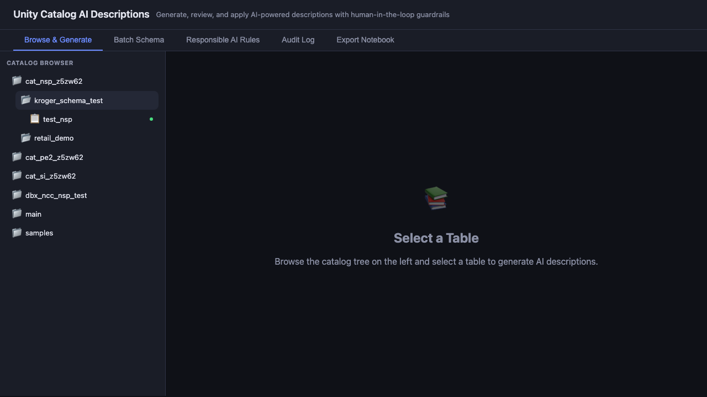

# Unity Catalog AI Descriptions - Databricks App

A Databricks App that generates AI-powered descriptions for Unity Catalog tables and columns using Claude on Foundation Model API (FMAPI), with human-in-the-loop review and Responsible AI guardrails.

Deployable as a **Databricks Asset Bundle** with git-controlled configuration.

## Problem Statement

Databricks Unity Catalog supports AI-generated descriptions for tables and columns via the UI, but customers need:
1. **Programmatic/automated access** - Apply AI descriptions at scale via API, not one table at a time in the UI
2. **Human-in-the-loop review** - Review AI suggestions before applying, with ability to edit
3. **Responsible AI guardrails** - Enforce organizational rules (PII handling, terminology, compliance)
4. **Audit trail** - Track who approved what, when, and what the AI originally suggested vs what was applied

## Architecture

```
Browser  -->  Databricks App (FastAPI)  -->  Foundation Model API (Claude Sonnet)
                    |                              |
                    v                              v
             Unity Catalog API            AI Description Generation
             (browse / apply)             (single + batch)
                    |
                    v
             Delta Table (Centralized Audit Log)
```

### Configuration Architecture

Two-layer git-controlled configuration:

| Layer | File | Controls |
|-------|------|----------|
| Infrastructure | `databricks.yml` | Warehouse ID, serving endpoint, app title (env vars per target) |
| App Behavior | `config.yaml` | Responsible AI rules, centralized audit table path, catalog/schema exclusions |

---

## End-to-End Code Flow

This section walks through the complete application flow from deployment to usage, with screenshots of each step.

### Step 1: Clone and Configure

```bash
git clone https://github.com/sprakash277/uc-ai-descriptions.git
cd uc-ai-descriptions
```

**Edit `config.yaml`** to customize Responsible AI rules and exclusions:
```yaml
responsible_ai_rules: |
  - Never include PII field names or example values in descriptions.
  - Use business-friendly language suitable for a data catalog audience.
  - Do not reference internal system names or implementation details.

audit:
  table: "governance.ai_descriptions.audit_log"

exclusions:
  catalogs:
    - "__databricks_internal"
    - "system"
  schemas:
    - "information_schema"
```

### Step 2: Authenticate with Databricks CLI

```bash
databricks auth login --host https://<your-workspace>.azuredatabricks.net --profile <your-profile>
databricks auth profiles | grep <your-profile>
```

### Step 3: (Optional) Configure a Specific Service Principal

By default, Databricks automatically creates a dedicated Service Principal for the app on first deploy (e.g. `app-xxxxx uc-ai-descriptions`). If you want the app to run as an **existing SP** instead (e.g. one with pre-granted UC permissions), uncomment the `run_as` block in `databricks.yml` and set the SP's application ID:

```yaml
# In databricks.yml — under resources.apps.uc-ai-descriptions:
run_as:
  service_principal_name: <sp-application-id>   # UUID of the existing SP
```

Or pass it as a variable at deploy time:
```bash
databricks bundle deploy --profile <your-profile> \
  --var="service_principal_id=<sp-application-id>"
```

**When to use each option:**

| Option | When to use |
|--------|-------------|
| Auto-generated SP (default) | New deployments — Databricks manages the SP lifecycle |
| Existing SP | You have an SP already granted UC permissions across catalogs |

### Step 4: Validate and Deploy the Bundle

```bash
# Validate the bundle configuration
databricks bundle validate --profile <your-profile>

# Deploy (uploads files + creates/updates app resource)
databricks bundle deploy --profile <your-profile>

# Deploy the app runtime
databricks apps deploy uc-ai-descriptions \
  --source-code-path /Workspace/Users/<your-email>/.bundle/uc-ai-descriptions/dev/files \
  -p <your-profile>
```

### Step 5: Attach Resources

Add the SQL warehouse and serving endpoint as app resources:
```bash
databricks api patch /api/2.0/apps/uc-ai-descriptions --profile <your-profile> --json '{
  "resources": [
    {"name": "sql-warehouse", "sql_warehouse": {"id": "<warehouse-id>", "permission": "CAN_USE"}},
    {"name": "serving-endpoint", "serving_endpoint": {"name": "databricks-claude-sonnet-4-6", "permission": "CAN_QUERY"}}
  ]
}'
```

### Step 6: Grant Service Principal Permissions

> **Important — Shared Identity Model**
>
> This app runs all Unity Catalog operations (browsing, reading metadata, and applying descriptions) under a **single shared service principal**, not under each end user's individual identity. This means:
>
> - **What users can see** in the app is determined by what the SP has been granted access to — not by the individual user's own UC permissions.
> - **Descriptions are applied to Unity Catalog by the SP**, not by the logged-in user. From UC's perspective, every change was made by the SP.
> - **The audit log** records the approver as `"app_user"` for all users. It tracks *that* a change was made and reviewed, but does not capture *which* user approved it.
>
> **Implication for operators:** Grant the SP access only to catalogs and schemas you want all app users to be able to browse and modify descriptions on. The SP's access defines the app's scope — it acts as a shared service account on behalf of all users.
>
> Per-user identity tracking (passing the logged-in user's OAuth token through to UC) is a planned future improvement.

Find the SP application ID:
```bash
databricks apps get uc-ai-descriptions -p <your-profile> | grep service_principal_client_id
```

Grant Unity Catalog permissions (run in SQL or notebook):
```sql
-- Replace <sp-id> with the SP's UUID from the command above
-- Permissions on data catalogs/schemas the app will describe
GRANT USE CATALOG ON CATALOG <catalog> TO `<sp-id>`;
GRANT USE SCHEMA ON SCHEMA <catalog>.<schema> TO `<sp-id>`;
GRANT SELECT, MODIFY ON SCHEMA <catalog>.<schema> TO `<sp-id>`;

-- Permissions on the centralized audit table
GRANT USE CATALOG ON CATALOG governance TO `<sp-id>`;
GRANT USE SCHEMA ON SCHEMA governance.ai_descriptions TO `<sp-id>`;
GRANT CREATE TABLE ON SCHEMA governance.ai_descriptions TO `<sp-id>`;
GRANT MODIFY ON SCHEMA governance.ai_descriptions TO `<sp-id>`;
```

### Step 7: Redeploy and Verify

```bash
# Redeploy to pick up resource permissions
databricks apps deploy uc-ai-descriptions \
  --source-code-path /Workspace/Users/<your-email>/.bundle/uc-ai-descriptions/dev/files \
  -p <your-profile>

# Check status
databricks apps get uc-ai-descriptions -p <your-profile>
```

### Startup Audit Validation

Every time the app starts, it automatically validates and bootstraps the audit table configured in `config.yaml`. The startup check:

1. **Validates** the `audit.table` setting is a valid `catalog.schema.table` name
2. **Checks** the catalog is accessible to the service principal
3. **Creates the schema** if it doesn't exist (requires `CREATE SCHEMA` privilege on the catalog)
4. **Creates the audit table** if it doesn't exist (requires `CREATE TABLE` + `MODIFY` on the schema)

**If audit setup fails**, the app continues running but audit logging will be disabled. Look for `ERROR server.audit:` lines in the app logs:

```
https://uc-ai-descriptions-<workspace-id>.azure.databricksapps.com/logz
# or
databricks apps logs uc-ai-descriptions --tail-lines 50 -p <your-profile>
```

Common error patterns and fixes:

| Error | Fix |
|-------|-----|
| `cannot access catalog '<catalog>'` | `GRANT USE CATALOG ON CATALOG <catalog> TO '<sp-id>';` |
| `schema '...' does not exist and could not be created` | `GRANT CREATE SCHEMA ON CATALOG <catalog> TO '<sp-id>';` |
| `could not create table '...'` | `GRANT CREATE TABLE ON SCHEMA <schema> TO '<sp-id>'; GRANT MODIFY ON SCHEMA <schema> TO '<sp-id>';` |
| `not a valid 3-part name` | Fix `audit.table` in `config.yaml` — must be `catalog.schema.table` |

---

## App UI Walkthrough

Once deployed, navigate to the app URL. The app has five tabs that cover the full workflow.

### Tab 1: Browse & Generate (Single Table)

The landing page shows the **Catalog Browser** on the left. All catalogs in your Unity Catalog metastore are listed (excluding system catalogs defined in `config.yaml`).


Click a catalog to expand it and see schemas. Click a schema to see tables.



**Flow:**
1. Select a catalog from the tree (e.g., `samples`)
2. Expand to see schemas (e.g., `nyctaxi`)
3. Click a table (e.g., `trips`) to load its metadata and columns
4. Click **"Generate AI Descriptions"** to invoke Claude via FMAPI
5. Review the AI-generated descriptions for the table and each column
6. **Approve** (apply as-is), **Edit** (modify then apply), or **Reject** each suggestion
7. Click **"Apply to Metastore"** to write approved descriptions to Unity Catalog

### Tab 2: Batch Schema Processing

Generate AI descriptions for **ALL tables in a schema** at once. Select a catalog and schema from the dropdowns, then click **"Generate for All Tables"**.


**Flow:**
1. Select a catalog from the dropdown
2. Select a schema from the dropdown
3. Click **"Generate for All Tables"**
4. Results appear expandable per-table with individual approve/apply controls
5. Review and apply descriptions for each table and its columns

### Tab 3: Responsible AI Rules (Read-Only, Git-Controlled)

Responsible AI rules are defined in `config.yaml` and injected into the AI system prompt for **every** generation request (single and batch). Rules are **read-only** in the UI — to change them, edit `config.yaml` and redeploy.


The rules textarea is read-only with a note: *"To modify rules, edit `config.yaml` and redeploy."*

**How Rules Are Applied:**
- Rules are injected into the AI system prompt before every generation request
- They apply to both single-table and batch schema generation
- Rules are version-controlled in `config.yaml`
- Changes require a redeploy to take effect
- For automated notebooks, export a notebook — rules are embedded in the code

### Tab 4: Audit Log (Centralized)

Every approved or edited description is logged to a centralized Delta table (configured in `config.yaml` as `audit.table`, e.g., `governance.ai_descriptions.audit_log`). The audit table lives in a dedicated catalog/schema, separate from the described data, to enforce append-only governance.


**Audit entries track:**
- When the description was applied
- What the AI originally suggested
- What was actually applied (may differ if edited)
- Whether it was approved as-is or edited

> **Note:** The audit log records `applied_by` as `"app_user"` for all entries — individual user identity is not captured in the current version (see the shared identity model note in Step 5). The audit trail is useful for tracking *what changed and when*, but not *which user* made the change.

Click **"Refresh Audit Log"** to load entries from the centralized audit table.

### Tab 5: Export as Databricks Notebook

Download a self-contained Python notebook that can be scheduled as a Databricks Workflow job.


**The exported notebook:**
1. Creates a `_ai_description_reviews` Delta table in the target schema
2. Iterates all tables in the schema, calls `ai_query()` to generate descriptions
3. Inserts AI suggestions into the review table with status `pending`
4. Displays pending suggestions for human review (edit `final_description`, set `status='approved'`)
5. Applies all approved descriptions via `COMMENT ON TABLE` / `ALTER COLUMN COMMENT`
6. Tracks full audit trail: who approved, when, AI vs final description

**Scheduling as a Job:**
- Upload the notebook to your workspace
- Create a Databricks Workflow with two tasks:
  - **Task 1:** Run the "Generate" cells on a schedule (e.g., weekly)
  - **Task 2:** Human reviewers approve in the Delta table using SQL or a notebook UI
  - **Task 3:** Run the "Apply" cells to commit approved descriptions to Unity Catalog

---

## Configuration

### `databricks.yml` — Infrastructure (per-environment)

| Variable | Default | Description |
|----------|---------|-------------|
| `warehouse_id` | `""` (auto-detect) | SQL warehouse ID; empty = auto-select running serverless warehouse |
| `serving_endpoint` | `databricks-claude-sonnet-4-6` | Foundation Model API endpoint name |
| `app_title` | `Unity Catalog AI Descriptions` | Display title in the app header |
| `service_principal_id` | `""` (auto-generate) | SP application ID (UUID) to run the app as; empty = Databricks creates a dedicated SP automatically |

Override per target:
```yaml
targets:
  prod:
    variables:
      serving_endpoint: "databricks-claude-sonnet-4-6"
      warehouse_id: "abc123def456"
```

### `config.yaml` — App Behavior (git-controlled)

| Setting | Default | Description |
|---------|---------|-------------|
| `responsible_ai_rules` | (see file) | Rules injected into every AI generation prompt |
| `audit.table` | `governance.ai_descriptions.audit_log` | Centralized audit table (full three-part name) |
| `exclusions.catalogs` | `["__databricks_internal", "system"]` | Catalogs hidden from the browse tree |
| `exclusions.schemas` | `["information_schema"]` | Schemas hidden from the browse tree |

---

## Project Structure

```
uc-ai-descriptions/
  databricks.yml        # DAB bundle definition (infrastructure config)
  config.yaml           # App behavior config (rules, exclusions, audit)
  app.py                # FastAPI entry point, serves static frontend + API
  app.yaml              # Databricks App runtime command config
  requirements.txt      # Python dependencies
  server/
    __init__.py
    config.py           # Central config loader (config.yaml + env vars) + auth
    warehouse.py        # Centralized warehouse resolution with caching
    sql_utils.py        # SQL safety (identifier validation, comment escaping)
    catalog.py          # Unity Catalog operations (browse, apply comments)
    ai_gen.py           # AI description generation via FMAPI + notebook export
    audit.py            # Centralized Delta table audit logging
    routes.py           # All API endpoints
  static/
    index.html          # Single-page frontend (HTML/CSS/JS)
  screenshots/          # App screenshots for documentation
```

## API Endpoints

| Method | Path | Description |
|--------|------|-------------|
| GET | `/api/health` | Health check |
| GET | `/api/settings` | Current effective configuration |
| GET | `/api/warehouses` | List available SQL warehouses with state |
| GET | `/api/catalogs` | List all catalogs (respects exclusions) |
| GET | `/api/schemas/{catalog}` | List schemas in a catalog |
| GET | `/api/tables/{catalog}/{schema}` | List tables in a schema |
| GET | `/api/table/{full_name}` | Get table details + columns |
| POST | `/api/generate` | Generate AI descriptions for a single table |
| POST | `/api/generate/batch` | Generate AI descriptions for all tables in a schema |
| POST | `/api/apply/table` | Apply a table comment |
| POST | `/api/apply/column` | Apply a column comment |
| POST | `/api/apply/batch` | Apply multiple comments with audit logging |
| GET | `/api/rules` | Get Responsible AI rules (read-only, from config.yaml) |
| POST | `/api/export-notebook` | Download automation notebook |
| GET | `/api/audit` | Query centralized audit log entries |

## Local Development

```bash
export DATABRICKS_PROFILE=<your-profile>
pip install -r requirements.txt
uvicorn app:app --reload --port 8000
# Open http://localhost:8000
```

## Updating the App

After code changes:
```bash
databricks bundle deploy --profile <your-profile>
databricks apps deploy uc-ai-descriptions \
  --source-code-path /Workspace/Users/<your-email>/.bundle/uc-ai-descriptions/dev/files \
  -p <your-profile>
```

## Viewing App Logs

```
https://uc-ai-descriptions-<workspace-id>.azure.databricksapps.com/logz
```

Or via CLI:
```bash
databricks apps logs uc-ai-descriptions --tail-lines 50 -p <your-profile>
```

## E2E Test Results

All endpoints verified against the live deployment:

```
 1/9: Health Check             pass  {"status":"ok"}
 2/9: Settings                 pass  config.yaml loaded, rules present, exclusions active
 3/9: Rules (read-only)        pass  Returns rules from config.yaml
 4/9: POST /rules rejected     pass  405 Method Not Allowed (rules are git-controlled)
 5/9: List Catalogs            pass  3 catalogs returned (system/internal excluded)
 6/9: List Schemas             pass  8 schemas (information_schema excluded)
 7/9: List Tables              pass  Tables listed with metadata
 8/9: List Warehouses          pass  Warehouse ID, name, state, type returned
 9/9: AI Generation            pass  Claude generated table + column descriptions via FMAPI
```
